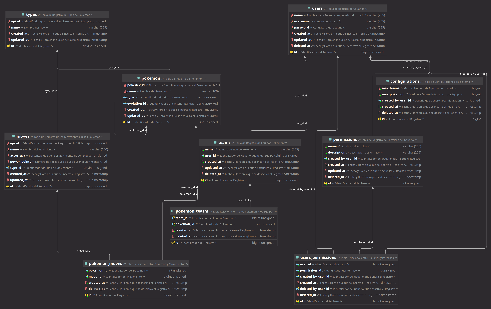

# Prueba Técnica para SERTI

Esta es la prueba técnica realizada para SERTI por Carlos Brighton Saldaña Ortiz

Este es el Backend del sistema, el Frontend se encuentra en [aquí](https://github.com/xxb1s/SERTI-Front)

## Generalidades
El sistema se pensó con los siguentes puntos:
- Consumir el API de Pokemon
- Consultar el nombre de un Pokemon o ID
  - Si el Pokemon no existe en la Base de Datos, guardarlo en esta
- Guardar los tipos de los Pokemon
- Guardar los movimientos de los Pokemon
- Mostrar la línea evolutiva de los Pokemon
- Realizar un frontend para la visualización
- Manejar usuarios y permisos para el sistema
- Permitir Generar Equipos a Usuarios Registrados

### Diagrama E-R

## Conclusiones
Lamentablemente el sistema no se terminó, sin embargo es un gran ejercicio
para continuar trabajando las habilidades en Java y SpringBoot, continuare trabajando
este ejercicio personalmente.